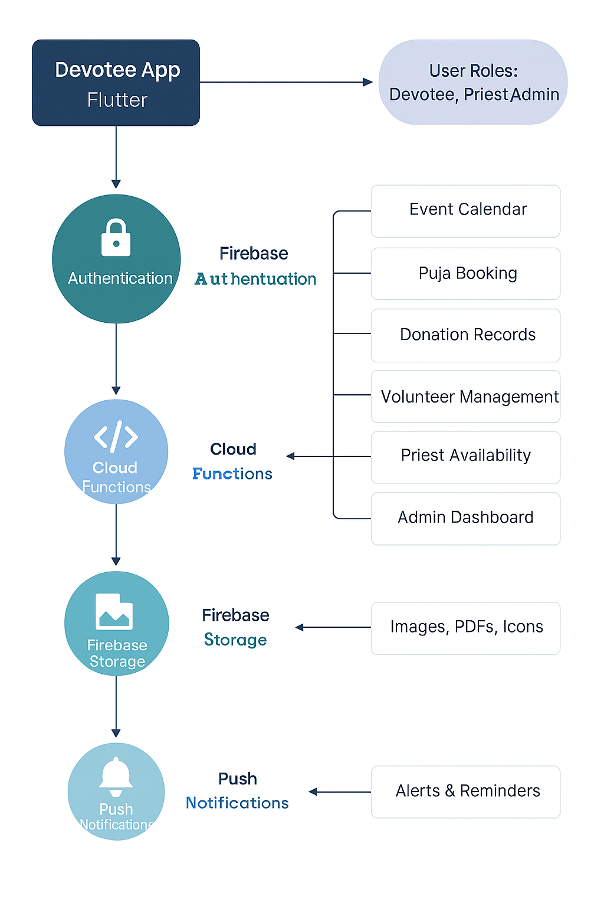

# 🛕 Sai Temple App – White Paper  
**Version:** v1.0  
**Date:** October 2025  
**Author:** Reetam Biswas

---

## Table of Contents
1. 🌸 Mission Summary
2. Introduction
3. ⚠️ Problem Summary
4. 🌟 Vision Summary
5. Goals & Objectives
   - 🙏 Devotee Experience
   - 🧘 Priest Tools
   - 🧮 Admin Dashboard
6. Architecture Overview
   - 🔍 Feature Breakdown
   - Technology Stack
7. Security & Privacy
8. Community Impact
9. Roadmap
10. References
11. Contact

---

## 1. 🌸 Mission Summary
The Temple App is designed to bridge tradition and technology by offering a mobile-first platform that deepens spiritual engagement, simplifies temple management, and strengthens community ties. It empowers devotees with easy access to rituals, events, and resources; equips priests with streamlined service tools; and supports administrators with efficient dashboards and analytics. By digitizing sacred experiences and operational workflows, the app fosters a more connected, inclusive, and spiritually vibrant temple ecosystem.

---

## 2. Introduction
Temples have long stood as sacred centers of devotion, learning, and community. Across generations, they have served not only as places of worship but as living embodiments of cultural heritage, spiritual practice, and social unity.

Beyond rituals and architecture, temples preserve oral traditions, music, dance, and regional customs that define the spiritual identity of a people. In today’s fast-paced, digitally connected world, the challenge lies in maintaining this sacred relevance while adapting to the needs of modern devotees—especially younger generations and diaspora communities.

The Temple App emerges in response to this evolving landscape, aiming to digitize access without diluting sanctity. By integrating technology with tradition, it seeks to uphold the temple’s timeless role while making spiritual engagement more accessible, inclusive, and responsive to contemporary life.

---

## 3. ⚠️ Problem Summary
Despite the central role temples play in spiritual and cultural life, many still rely on manual processes or cumbersome websites for managing events, bookings, and communication. This results in:

- ❌ Manual booking systems prone to errors and delays  
- ❌ Disconnected communication between devotees, priests, and admins  
- ❌ Limited access to temple services for tech-savvy or diaspora communities  

This digital gap hinders engagement, transparency, and operational flow—calling for a modern solution that honors tradition while embracing technology.

---

## 4. 🌟 Vision Summary
The Temple App envisions a unified digital platform that harmonizes the needs of devotees, priests, and administrators—creating a seamless ecosystem for spiritual engagement and temple operations.

- For devotees: intuitive access to rituals, events, and services from anywhere in the world  
- For priests: streamlined scheduling, service visibility, and communication tools  
- For administrators: powerful dashboards, booking management, and analytics  

By integrating these roles into a single mobile-first experience, the app fosters transparency, accessibility, and collaboration—ensuring that sacred traditions thrive in a modern, connected world.

---

## 5. Goals & Objectives

### 🙏 Devotee Experience
- Browse upcoming pujas, festivals, and spiritual talks via calendar view  
- Book personalized rituals with preferred priest, time, and location  
- Make secure donations to sponsor events or support temple upkeep  
- Access devotional content like bhajans, scriptures, and talks  

### 🧘 Priest Tools
- Manage availability and bookings through a dedicated dashboard  
- Showcase puja types, languages spoken, and ratings  
- Receive real-time updates via SMS or email for new requests and changes  

### 🧮 Admin Dashboard
- Monitor engagement, donation trends, and volunteer participation  
- Approve bookings, assign priests, and moderate content  
- Create and manage temple events with calendar integration and automated reminders  

---

## 6. Architecture Overview

### 🔍 Feature Breakdown
- 🖥️ Flutter Frontend: Cross-platform mobile UI for devotees, priests, and admins  
- 🔐 Firebase Authentication: Role-based login (Devotee, Priest, Admin)  
- 📂 Cloud Firestore: Real-time database for events, bookings, donations, and profiles  
- ⚙️ Cloud Functions: Serverless backend logic for approvals, analytics, and notifications  
- 🖼️ Firebase Storage: Stores temple images, flyers, and documents  
- 🔔 Push Notifications: Sends reminders for events, puja confirmations, and admin alerts  

Modules include:
- Event Calendar  
- Priest Booking  
- Donation Tracker  
- Volunteer Management  

### Technology Stack
- Flutter SDK  
- Firebase (Auth, Firestore, Cloud Functions, Storage)  
- GitHub for CI/CD  
- Stripe or Razorpay for payments  

---

## 7. Security & Privacy
- Role-based access control for devotees, priests, and admins  
- Data encryption for sensitive information  
- Secure donation processing  
- Privacy-first design with optional user anonymity  

---

## 8. Community Impact
- Preserves cultural and spiritual heritage through digital access  
- Expands reach to diaspora devotees and younger generations  
- Enables inclusive participation in temple life regardless of geography or mobility  

---

## 9. Roadmap

| Version | Features |
|---------|----------|
| v1.0    | Core features: booking, donations, calendar |
| v1.1    | Push notifications, live streaming |
| v2.0    | Multi-temple support, multilingual UI |

---

## 10. References
- [Sai Temple App README](../README.md) 
- [GitHub Repository](https://github.com/reetamit/sai_templeApp)  
- [Flutter API Docs](https://docs.flutter.dev/)  
- Design inspiration: lotus icons, Om symbolism  

## 8. Contact

For collaboration, feedback, or onboarding your temple, please reach out via GitHub Issues or email: `reetamit@gmail.com`